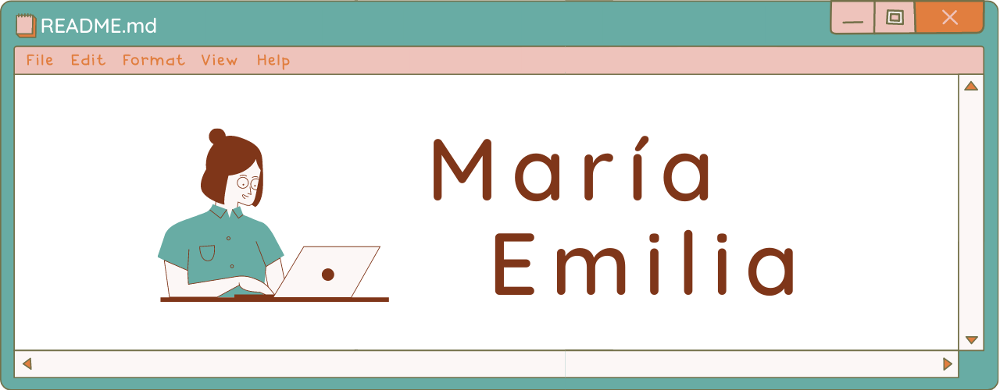

 

# Hi there, I'm Emy 🖐️

I'm studying computer engineering at the National Autonomous University of Mexico (UNAM) 🇲🇽. When I was in High School, I took a technical degree and, I learned how to say my first **HELLO WORLD!** in C. Now, I'm an AI and ML enthusiastic, and I want to become a Machine Learning engineer 😎 

I'm part of the [ACM-W UNAM](https://sites.google.com/view/acm-w-cdmx/p%C3%A1gina-principal) student chapter. We are a group of girls who want to empower women in computer science and engineering. Also, I am a Microsoft Learn Student Ambassador, and I'm part of the [Technolochicas](https://tecnolochicas.mx/) program by Bécalos. I enjoy sharing my knowledge with others, that's why I'm part of these programs ✨

  
More about me 🌻

  
  
  
  🧁 I love cooking  
  🗣️ I speak Spanish, Portuguese and English. Also I'm learning LSM (Mexican Sign Lenguage)  
  🎵 I like K-pop. My favorite group is SJ  
  📖 The Isaac Asimov's book "I, robot" got me  interested in computing  
  🎮 My favorite game is Sky: children of the light  
  

  

If you need help, feel free to send me a message, I'll answer it as soon as possible 💖

📌[LinnkedIn](https://www.linkedin.com/in/mariaemiliaramirezgomez)  
📌Discord Emy#8464  
📌[GitHub](https://github.com/MariaEmiliaRG/)  
📌Emilia.Ramirez@studentambassadors.com  

